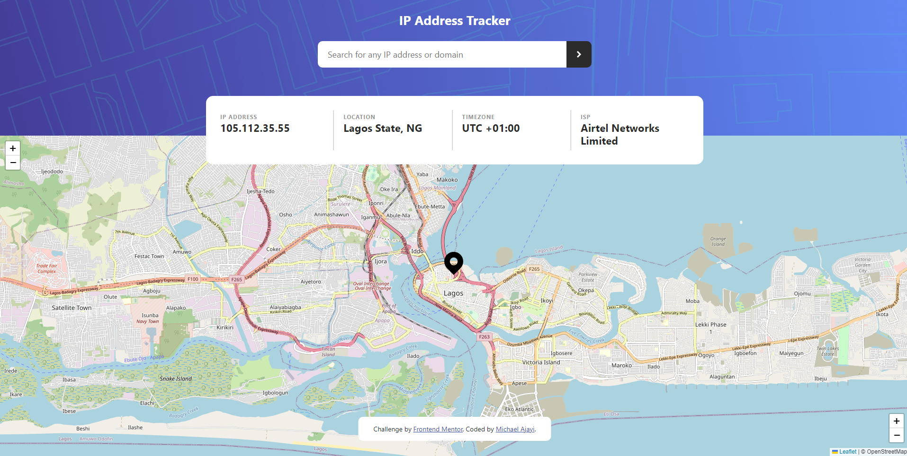

# Frontend Mentor - IP address tracker solution

This is a solution to the [IP address tracker challenge on Frontend Mentor](https://www.frontendmentor.io/challenges/ip-address-tracker-I8-0yYAH0). Frontend Mentor challenges help you improve your coding skills by building realistic projects. 

## Table of contents

- [Overview](#overview)
  - [The challenge](#the-challenge)
  - [Screenshot](#screenshot)
  - [Links](#links)
- [My process](#my-process)
  - [Built with](#built-with)
  - [Useful resources](#useful-resources)
- [Author](#author)

## Overview

### The challenge

Users should be able to:

- View the optimal layout for each page depending on their device's screen size
- See hover states for all interactive elements on the page
- See their own IP address on the map on the initial page load
- Search for any IP addresses or domains and see the key information and location

### Screenshot

A desktop view of how the web app looks like

### Links

- Solution URL: [Solution](https://www.frontendmentor.io/solutions/ip-address-tracker-XYJ-Ccogms)
- Live Site URL: [Live Link](https://mentor-ip-tracker.netlify.app/)

## My process

### Built with

- Semantic HTML5 markup
- CSS custom properties
- Flexbox
- CSS Grid
- Semantic HTML tags
- Mobile-first workflow
- [Less](https://lesscss.org/) - CSS preprocessors
- [Bootstrap](https://getbootstrap.com/) - CSS library
- [LeafletJS](https://leafletjs.com/) - For Map
- [IP Geolocation API by IPify](https://geo.ipify.org/) - For IP address

### Useful resources

- [JS Fiddle Snippet](https://jsfiddle.net/nstudor/xcmdwfjk/) - This helped me for understanding how to change map location while using [LeafletJS](https://leafletjs.com/). I really liked this pattern and will use it going forward.
- [StackOverflow Discussion](https://stackoverflow.com/questions/391979/how-to-get-clients-ip-address-using-javascript) - I found this discussion while trying to fecth user location and ip address without a given access. I find this very useful as this worked out with what the challenge is about.
- [LeafletJS](https://leafletjs.com/) - For the mapping API, I recommend using it; It's free to use and doesn't require an API Key. If you decide to use another API, like Google Maps or Mapbox, be sure to secure your API Key. Here are guides for both Google Maps and Mapbox, be sure to read through them thoroughly:

- [API Key best practices from Google Developers](https://developers.google.com/maps/api-key-best-practices)
- [How to use Mapbox securely](https://docs.mapbox.com/help/troubleshooting/how-to-use-mapbox-securely/)

## Author

- Website - [Michael Ajayi](https://michael-a.netlify.app)
- Frontend Mentor - [@michaelajayi150](https://www.frontendmentor.io/profile/michaelajayi150)
- Twitter - [@michaelajayi150](https://www.twitter.com/michaelajayi150)
- LinkedIn - [@ajayi-michael-692bb6203](https://www.linkedin.com/in/ajayi-michael-692bb6203/)